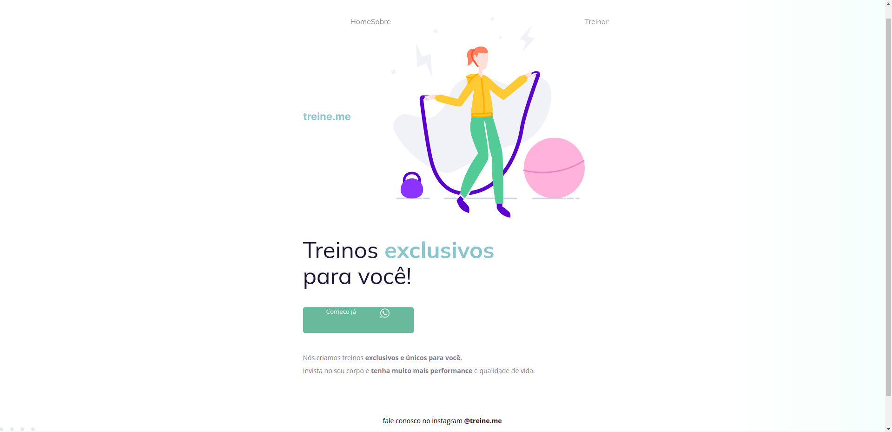

# Desafio 1 Fase2 - Stage2 Corrigindo Bugs 🚀
 
## Antes:

## Depois:

Nesse projeto não criei um novo link pois o resultado é o projeto 2, que pode ser acessado [aqui](https://victorm-mp.github.io/Projeto-02/)

## Tecnologias 🛠
- HTML
- CSS
- Git e Github

## Descrição 📖
Igual ao desafio 1 da fase 1, os elementos estão arranjados de uma forma diferente na tela. O objetivo é ficar igual ao design do figma

## Contato ⭐
victormatheus.mpm@gmail.com

www.linkedin.com/in/victormatheus-mp
